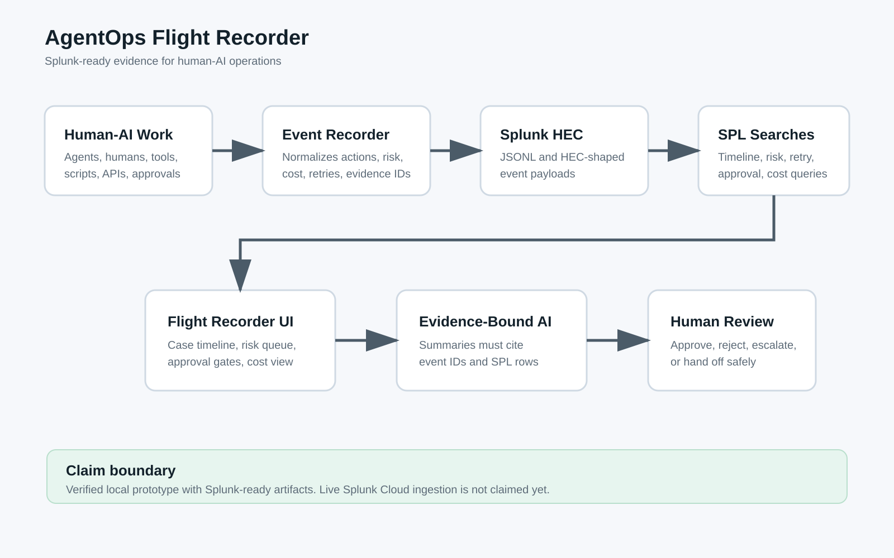

# Architecture — AgentOps Flight Recorder

AgentOps Flight Recorder turns human-AI operational work into Splunk-ready evidence.

## Data Flow

1. A human-AI workflow emits structured AgentOps events.
2. The event recorder normalizes actions, tools, approvals, risks, costs, retries, and handoff points.
3. Events are exported as JSONL and Splunk HEC-shaped payloads.
4. SPL searches reconstruct timelines, high-risk actions, retry loops, approval gates, and cost signals.
5. The Flight Recorder dashboard gives humans an incident-review surface.
6. The AI-assisted investigator can summarize only from cited event IDs and SPL result rows.

## Splunk Interaction

- `shared-agentops-engine/adapters/splunk/hec_events.jsonl` contains Splunk HEC-shaped events.
- `shared-agentops-engine/adapters/splunk/searches.spl` contains draft SPL searches.
- `splunk-agentic-ops/prototype/flight-recorder-dashboard.html` shows the review experience before live Splunk ingestion is claimed.

## AI Integration

The AI layer is intentionally evidence-bound. It can summarize the operational timeline, identify risky patterns, and suggest next human actions, but it must cite event IDs from the event trail. It cannot invent facts outside the Splunk-searchable evidence.

## Claim Boundary

This repository contains a verified local prototype and Splunk-ready artifacts. It does not claim live Splunk Cloud ingestion or a live Splunk dashboard yet.
