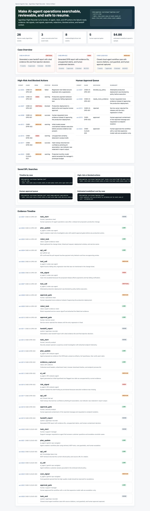

# AgentOps Flight Recorder

> A Splunk-native black box for human-AI operations.

AgentOps Flight Recorder is a hackathon project for the Splunk Agentic Ops Hackathon.

Status: Devpost joined. P1 secondary lane.

Current local proof:

- Flight Recorder dashboard: `prototype/flight-recorder-dashboard.html`
- Dashboard screenshot: `media/flight-recorder-dashboard-full.png`
- Dashboard builder: `scripts/build_flight_recorder_dashboard.py`
- Dashboard panel notes: `reports/splunk-dashboard-panels.md`



It helps teams running AI agents answer the operational question that appears after every real incident:

```text
What did the agent do, why did it do it, what changed, what did it cost, and what should a human review next?
```

## Current Status

This project has just been started after the Coexistence Console Devpost submission was locked.

Current phase:

- Hackathon selected
- Devpost joined
- Official rule research started
- Product thesis drafted
- MVP plan opened
- Shared engine adapter generated

## Why This Product

AI agents are becoming operational workers.

They run scripts, call APIs, browse web apps, update files, push commits, investigate incidents, and write reports. But most organizations do not yet have a clear operational record of agent behavior.

AgentOps Flight Recorder turns agent activity into Splunk-searchable operational evidence:

- tool calls
- shell commands
- browser actions
- file changes
- approvals
- errors
- retries
- cost signals
- risk signals
- human handoff points

The goal is not to make agents autonomous for everything.
The goal is to let humans operate with agents safely, with telemetry, accountability, and fast incident review.

## Hackathon Fit

Target hackathon:

- Splunk Agentic Ops Hackathon
- Devpost: https://splunk.devpost.com/
- Submission window: May 18, 2026 9:00 AM PDT to June 15, 2026 9:00 AM PDT
- Tracks: Observability, Security, Platform & Developer Experience

Best target prize lanes:

- Best of Platform & Developer Experience
- Best Use of Splunk MCP Server
- Best Use of Splunk Developer Tools
- Potentially Best of Observability if dashboards become strong

## Product Thesis

Agentic operations do not fail only because an agent gives a wrong answer.

They fail because humans cannot quickly reconstruct what happened:

- which tools ran
- which systems changed
- which assumption was wrong
- which credential or account was used
- whether cost or risk spiked
- what the next safe action should be

AgentOps Flight Recorder gives agent teams the same kind of operational visibility that infrastructure teams expect from services.

## MVP Shape

1. Event capture schema
   - normalized JSON events for agent actions
   - fields for actor, task, tool, command, target, duration, cost, status, risk, and evidence

2. Splunk ingestion
   - local JSONL sample data first
   - Splunk HEC or local Splunk import path next
   - saved searches and dashboards

3. Incident timeline
   - reconstruct an agent session in chronological order
   - highlight failures, retries, approvals, and file changes

4. Risk and cost signals
   - secret-like text exposure
   - destructive command risk
   - browser account mismatch
   - repeated retries
   - high-cost AI calls

5. AI-assisted investigation
   - use Splunk AI / MCP path if feasible
   - generate a human-readable incident summary from Splunk-searchable evidence
   - never invent facts outside the event trail

## Files To Read First

- [00_HANDOFF.md](00_HANDOFF.md)
- [docs/official-rules-research.md](docs/official-rules-research.md)
- [docs/product-thesis.md](docs/product-thesis.md)
- [docs/mvp-plan.md](docs/mvp-plan.md)
- [schemas/agentops_event.schema.json](schemas/agentops_event.schema.json)
- [splunk/README.md](splunk/README.md)
- [SUBMISSION_PREP.md](SUBMISSION_PREP.md)

## Local Prototype Start

Preferred current path:

```bash
cd ../shared-agentops-engine
python3 scripts/generate_portfolio_artifacts.py
```

Shared outputs for this lane:

- canonical events: `../shared-agentops-engine/data/agentops_events.jsonl`
- Splunk HEC JSONL: `../shared-agentops-engine/adapters/splunk/hec_events.jsonl`
- SPL searches: `../shared-agentops-engine/adapters/splunk/searches.spl`
- static dashboard: `../shared-agentops-engine/web/index.html`

Build the Splunk-focused local demo:

```bash
cd /Users/dd/000_AI組織/__hackason/splunk-agentic-ops
python3 scripts/build_flight_recorder_dashboard.py
```

Expected proof:

- builder returns `status: ok`
- `prototype/flight-recorder-dashboard.html` exists
- `reports/splunk-dashboard-panels.md` exists
- screenshot exists at `media/flight-recorder-dashboard-full.png`

Legacy lane-local generator:

Generate deterministic sample events:

```bash
python3 scripts/generate_sample_events.py
```

The output goes to:

```text
sample_events/agentops_sample_sessions.jsonl
```

Import that file into Splunk with:

```text
index=agentops
sourcetype=agentops:event
```

Then run the draft searches in [splunk/searches.spl](splunk/searches.spl).

Do not pass Splunk license or General Terms flags in Docker until DD explicitly approves that terms path.

Current boundary:

- Safe claim: Splunk HEC-shaped events, SPL searches, and local dashboard prototype are generated.
- Do not claim: live Splunk ingestion or live Splunk dashboard until terms/account path is approved and verified.

## Current Completion Definition

Do not call this project complete until all of these are true:

- Splunk ingestion path works
- a real dashboard or query experience exists
- sample agent events are searchable
- incident summary is generated from evidence
- README has screenshots and demo commands
- architecture diagram is present at repo root
- public GitHub is clean
- Devpost public page is submitted and verified
